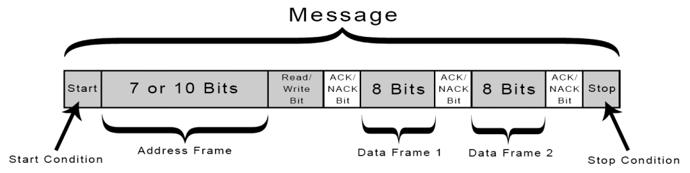
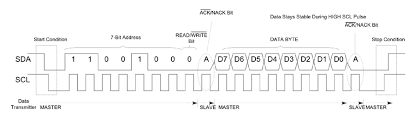

# I2C module 
## TODO for README
- [ ] add state machine image
## Contents
- [Introduction](#introduction)
- [Dataframe](#dataframe)
- [Waveform](#waveform)
  - [Starting Communication](#starting-communication)
  - [Ending Communication](#ending-communication)
- [State Machine](#state-machine)
  - [State Machine Overview for I2C Slave Module](#state-machine-overview-for-i2c-slave-module)

## Introduction 
The Inter-Integrated Circuit (I2C) protocol is a widely used communication protocol developed by Philips Semiconductor in the early 1980s. It is a synchronous, multi-master, multi-slave, serial communication bus that allows multiple devices to be connected using just two lines: a serial data line (SDA) and a serial clock line (SCL). I2C is commonly used for communication between microcontrollers and peripheral devices such as sensors, memory chips, and displays within embedded systems. The protocol supports various data transfer speeds, including Standard (up to 100 kHz), Fast (up to 400 kHz), and High-speed (up to 3.4 MHz) modes, making it versatile for a wide range of applications. I2C’s simplicity and low pin count make it ideal for situations where space and wiring are limited.

## Dataframe 

- **Start Condition**: The SDA line switches from a high voltage level to a low voltage level before the SCL line switches from high to low.

- **Stop Condition**: The SDA line switches from a low voltage level to a high voltage level after the SCL line switches from low to high.

- **Address Frame**: A 7 or 10 bit sequence unique to each slave that identifies the slave when the master wants to talk to it.

- **Read/Write Bit**: A single bit specifying whether the master is sending data to the slave (low voltage level) or requesting data from it (high voltage level).

- **ACK/NACK Bit**: Each frame in a message is followed by an acknowledge/no-acknowledge bit. If an address frame or data frame was successfully received, an ACK bit is returned to the sender from the receiving device. 

## Waveform

### **Starting Communication:**
1. **Start Condition:**
   - The communication begins with a **Start Condition**, indicated by the Master device.
   - This occurs when the SDA line transitions from **high to low** while the SCL line remains **high**.
   - The Start Condition signals all connected slave devices that a data transfer is about to begin.

2. **Address Frame:**
   - After the Start Condition, the master sends a **7-bit address** on the SDA line, which identifies the slave device it intends to communicate with.
   - This is followed by a **Read/Write (R/W) bit**, where `0` indicates a write operation and `1` indicates a read operation.
   - Each bit is transmitted on the falling edge of the SCL clock.

3. **Acknowledgment (ACK) Bit:**
   - After the address and R/W bit are transmitted, the slave responds by pulling the SDA line **low** during the ACK clock pulse, indicating that it has received the address correctly.
   - If the SDA line remains high during this pulse, it indicates a **No Acknowledgment (NACK)**, meaning the slave did not recognize the address.

### **Ending Communication:**
1. **Data Transfer:**
   - The data transfer follows the acknowledgment. The master or slave sends a **data byte (8 bits)** on the SDA line.
   - After each byte, the receiving device sends an ACK bit, similar to the address acknowledgment.

2. **Stop Condition:**
   - Communication ends with a **Stop Condition**, initiated by the Master.
   - This is indicated by the SDA line transitioning from **low to high** while the SCL line remains **high**.
   - The Stop Condition signals to the slave devices that the data transfer is complete and the bus is now free for other communications.

## State Machine 

### State Machine Overview for I2C Slave Module

1. **STATE_IDLE (2'd0):**
   - **Description:** This is the default state where the slave is idle, waiting for a start condition.
   - **Transition:** The state machine remains in this state until a start condition is detected.

2. **STATE_DEV_ADDR (2'd1):**
   - **Description:** In this state, the slave checks if the incoming address on the bus matches its own address.
   - **Transition:** 
     - If the address matches, the state machine checks the Read/Write bit to determine the next state.
     - If the address does not match, the state machine returns to `STATE_IDLE`.
     - If the operation is a read (`R/W` bit is high), it will transition to `STATE_READ` (not yet implemented).
     - If the operation is a write (`R/W` bit is low), it transitions to `STATE_WRITE`.

3. **STATE_WRITE (2'd3):**
   - **Description:** This state handles the writing of data from the master to the slave. The data is loaded into a buffer as it is received.
   - **Transition:** The state machine remains in `STATE_WRITE` until a stop condition is detected or the master sends another command.

4. **STATE_READ (2'd2) [Not Yet Implemented]:**
   - **Description:** This state is intended to handle the reading of data from the slave by the master. The implementation will involve sending data from the slave to the master in response to a read command.
   - **Future Work:** Implementation of this state is planned and will enable full read/write functionality for the I2C slave module.

### Note:
The `STATE_READ` is currently a placeholder in the code, and its logic will be developed in future iterations to complete the module's functionality.