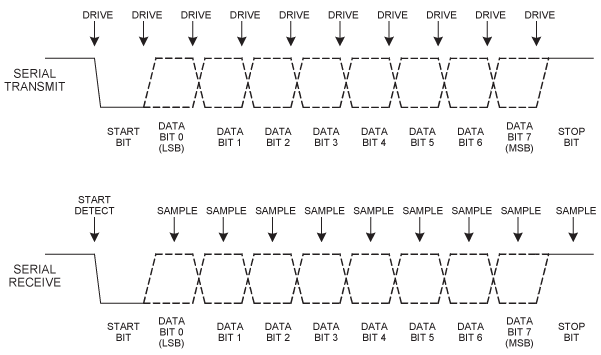

# UART Module
## TODO for README
- [ ] add state machine image

## Contents

1. [Introduction](#introduction)
2. [Data Frame](#data-frame)
   - [Start Bit](#start-bit)
   - [Data Bits](#data-bits)
   - [Parity Bit (Optional)](#parity-bit-optional)
   - [Stop Bits](#stop-bits)
   - [Idle Line](#idle-line)
   - [Baud Rate](#baud-rate)
3. [Waveform](#waveform)
   - [Idle State](#idle-state)
   - [Start Bit](#start-bit-1)
   - [Data Bits](#data-bits-1)
   - [Parity Bit (if used)](#parity-bit-if-used)
   - [Stop Bit(s)](#stop-bits-1)
4. [State Machine](#state-machine)
   - [UART Transmitter State Machine Description](#uart-transmitter-state-machine-description)
     - [s_IDLE (Idle State)](#s_idle-idle-state)
     - [s_TX_START_BIT (Start Bit State)](#s_tx_start_bit-start-bit-state)
     - [s_TX_DATA_BITS (Data Bits State)](#s_tx_data_bits-data-bits-state)
     - [s_TX_STOP_BIT (Stop Bit State)](#s_tx_stop_bit-stop-bit-state)
     - [s_CLEANUP (Cleanup State)](#s_cleanup-cleanup-state)

## Introduction
UART (Universal Asynchronous Receiver/Transmitter) is a widely used communication protocol that facilitates serial data exchange between electronic devices without requiring a separate clock signal for synchronization. Instead, it relies on pre-defined parameters such as baud rate, parity, and stop bits, which must match between the transmitting and receiving devices to ensure accurate data transfer. The UART protocol consists of a transmitter (TX) that converts parallel data into a serial format for transmission, and a receiver (RX) that converts the serial data back into parallel format. The baud rate, measured in bits per second (bps), dictates the speed of transmission, while an optional parity bit can be used for error checking to ensure data integrity.

## Data Frame 

1. **Start Bit:**
   - The data frame begins with a **start bit**, which is typically a low voltage level (`0`).
   - The start bit signals the beginning of a new data transmission and prepares the receiver for incoming data.

2. **Data Bits:**
   - Following the start bit, the **data bits** are transmitted.
   - A standard UART frame can contain **5 to 9 data bits** (most commonly 8).
   - Data is sent **LSB (Least Significant Bit) first**, meaning the least important bit is transmitted first.

3. **Parity Bit (Optional):**
   - After the data bits, an **optional parity bit** may be included for error detection.
   - The parity bit can be **even** or **odd**, depending on the configuration:
     - **Even Parity:** The parity bit is set to `1` if the number of `1`s in the data bits is odd, making the total count even.
     - **Odd Parity:** The parity bit is set to `1` if the number of `1`s in the data bits is even, making the total count odd.

4. **Stop Bits:**
   - The data frame ends with one or more **stop bits**, which are typically high voltage levels (`1`).
   - Stop bits signal the end of the data frame and provide a short gap before the next frame begins.
   - Common configurations include **1, 1.5, or 2 stop bits**.

5. **Idle Line:**
   - After the stop bit(s), the UART line remains in an **idle state** (high voltage level) until the next start bit is detected, signaling the beginning of the next data frame.

6. **Baud Rate:**
   - The **baud rate** defines the speed of data transmission and represents the number of bits transmitted per second.
   - Both the transmitter and receiver must be set to the same baud rate for proper communication.

## Waveform 

### Waveform Description

1. **Idle State:**
   - The line is held in a high logic state when no data is being transmitted. This is the default idle state of the UART line.

2. **Start Bit:**
   - The transmission begins with a transition from high to low logic state, indicating the start of the data frame.

3. **Data Bits:**
   - Following the start bit, a sequence of data bits is transmitted, each represented by transitions between high and low logic states.

4. **Parity Bit (if used):**
   - After the data bits, the parity bit (if configured) is transmitted, following the same logic state rules as the data bits.

5. **Stop Bit(s):**
   - The transmission ends with one or more stop bits, where the line returns to the high logic state, indicating the end of the data frame and allowing time for the receiver to prepare for the next frame.

## State Machine
### UART Transmitter State Machine Description

The UART transmitter module employs a finite state machine (FSM) to manage the process of transmitting serial data. The state machine controls the flow of data through the transmitter and ensures that the data is sent correctly, including the start bit, data bits, and stop bit. The state machine consists of the following states:

1. **s_IDLE (Idle State):**
   - **Description:** This is the default state of the UART transmitter. In this state, the line is held high, and no transmission is taking place.
   - **Transitions:** If the `i_Tx_DV` (transmit data valid) signal is high, indicating that there is data to be transmitted, the state machine transitions to the `s_TX_START_BIT` state. Otherwise, it remains in the `s_IDLE` state.

2. **s_TX_START_BIT (Start Bit State):**
   - **Description:** In this state, the transmitter sends the start bit, which is a low logic state (0). This signals the beginning of a data frame.
   - **Transitions:** The state machine waits for `CLKS_PER_BIT - 1` clock cycles to complete the transmission of the start bit. Once the clock count reaches this threshold, it transitions to the `s_TX_DATA_BITS` state.

3. **s_TX_DATA_BITS (Data Bits State):**
   - **Description:** This state handles the transmission of the data bits. Each bit of the data byte is sent sequentially.
   - **Transitions:** The state machine continues to send data bits for `CLKS_PER_BIT - 1` clock cycles. After sending each bit, it checks if all 8 bits have been transmitted. If not, it increments the bit index and remains in this state. Once all bits are sent, it transitions to the `s_TX_STOP_BIT` state.

4. **s_TX_STOP_BIT (Stop Bit State):**
   - **Description:** In this state, the transmitter sends the stop bit, which is a high logic state (1). This signals the end of the data frame.
   - **Transitions:** The state machine waits for `CLKS_PER_BIT - 1` clock cycles to complete the stop bit transmission. Afterward, it sets the `o_Tx_Done` signal high to indicate that transmission is complete, then transitions to the `s_CLEANUP` state.

5. **s_CLEANUP (Cleanup State):**
   - **Description:** This state is used to finalize the transmission process. The `o_Tx_Done` signal is set low, and the state machine returns to the `s_IDLE` state.
   - **Transitions:** After one clock cycle, the state machine transitions back to the `s_IDLE` state, ready for the next transmission.

